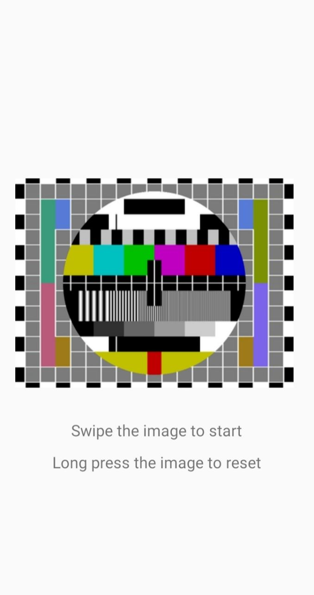
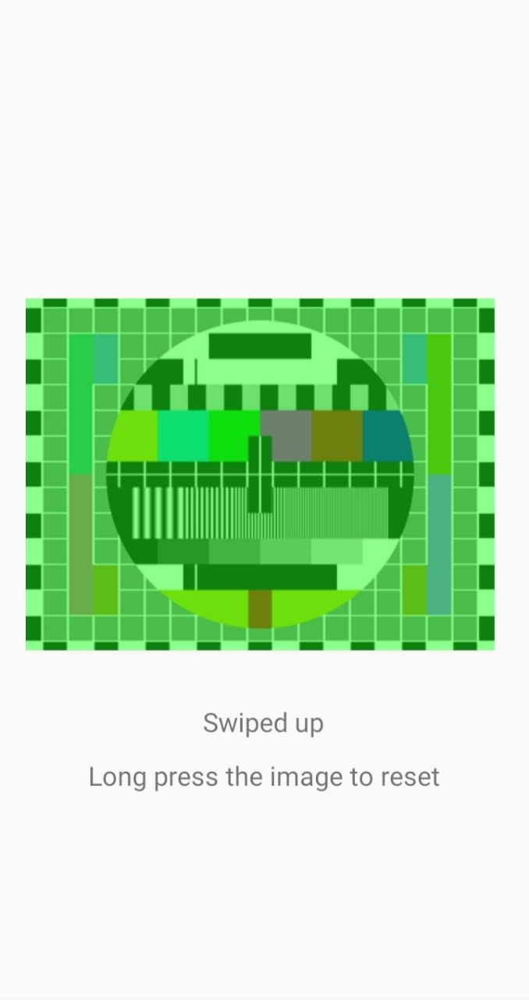
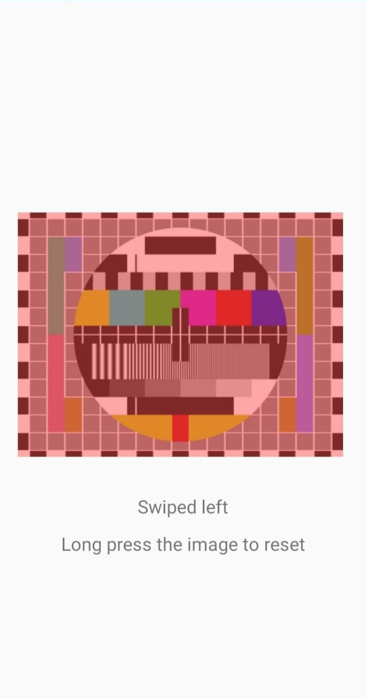

## Image_V - Gesture Detector
This simple app detects five different gestures - swipe up, swipe down, swipe left, swipe right and long press.
App changes the color of the image if any swipe gesture is detected. Long press resets the image color. \
This app is small project for the Mobile Computing course.

  
